# OptiSim // Enterprise Causal Inference & Operations Research Platform

A mathematically rigorous, production-grade experimentation and portfolio optimization platform. OptiSim bridges the gap between **Causal Data Science** and **Operations Research**: moving beyond naive p-values to solve enterprise decision problems under capital, latency, and engineering resource constraints.

[](tests/)
[](https://www.python.org/)
[](https://fastapi.tiangolo.com/)
[](https://nextjs.org/)
[](https://highs.dev/)
[](LICENSE)

---

## 1. Executive Summary & Problem Formulation

Standard commercial experimentation platforms answer a narrow question: *"Did Variant B achieve statistical significance ($p < 0.05$)?"*

In enterprise reality, this produces catastrophic failure modes:
1. **The Peeking Problem**: Stakeholders inspect dashboards continuously, inflating false positive rates from 5% to over 30%.
2. **Winner's Curse & Phantom Value**: Point-estimate projections select for positive noise, systematically overpromising commercial revenue.
3. **Multiplicity False Alarms**: Tracking 15 operational metrics across microservices without False Discovery Rate (FDR) control guarantees false alerts.
4. **The Deployment Chasm**: A feature with +1.5% CVR that adds +180ms p99 latency or exhausts cloud infrastructure budgets cannot be deployed in isolation. Experimentation must be coupled with **combinatorial resource optimization**.

OptiSim unifies **Anytime-Valid Causal Inference** with **Mixed-Integer Linear Programming (MILP)** to deliver mathematically defensible, multi-constraint rollout decisions.

---

## 2. System Architecture

```mermaid
flowchart TD
    subgraph Ingestion ["1. Data Ingestion & Streaming"]
        A1["Continuous User Arrivals Stream"]
        A2["Clustered Session Logs (CSV / DB)"]
        A3["Candidate Experiment Features Pool"]
    end

    subgraph CausalCore ["2. Algorithmic Causal Inference Core (ab_testing_platform)"]
        B1["Anytime-Valid Confidence Sequences\n(Waudby-Smith & Ramdas, 2021)"]
        B2["CUPED Covariate Adjustment\n(Deng et al., 2013)"]
        B3["Cluster-Robust Delta Method\n(Deng et al., 2018)"]
        B4["Heterogeneous Treatment Effects (CATE)\n& Cochran's Q Heterogeneity Test"]
        B5["Multi-Metric Guardrails Engine\nwith Benjamini-Hochberg FDR (1995)"]
    end

    subgraph OperationsResearch ["3. Operations Research & Combinatorial Optimization"]
        C1["Chance-Constrained Defensible Floor\n(Conservative 95% Bound)"]
        C2["Downstream Churn & Retention Penalty"]
        C3["Multi-Constraint 0-1 Knapsack MILP\n(SciPy HiGHS Solver Backend)"]
        C4["Pareto Efficient Frontier Generator"]
    end

    subgraph Services ["4. Decoupled Service Layer (backend/)"]
        D1["FastAPI v2.0 Typed REST Engine"]
        D2["Pydantic v2 Contract Validation"]
        D3["Automated Decision Memo Generator"]
    end

    subgraph Interfaces ["5. Enterprise Presentation Layer"]
        E1["Next.js 15 App Router Frontend\n(Tailwind CSS v4, Recharts, Lucide)"]
        E2["Interactive Streamlit Dashboard (app.py)\n(Plotly Interactive Surfaces)"]
    end

    Ingestion --> CausalCore
    CausalCore --> OperationsResearch
    OperationsResearch --> Services
    Services --> Interfaces
```



---

## 3. Theoretical Compendium & Mathematical Foundations

### 3.1 Anytime-Valid Confidence Sequences (Eliminating the Peeking Problem)
Fixed-horizon Wald z-tests assume exactly one look at pre-committed sample size $N$. Dashboard peeking inflates nominal $\alpha = 0.05$ to $\approx 30\%$ due to the Law of the Iterated Logarithm ($\limsup_{n \to \infty} \frac{S_n}{\sqrt{2n \log \log n}} = 1$).

OptiSim implements time-uniform asymptotic confidence sequences (Waudby-Smith & Ramdas, 2021):

$$\text{CS}_n(\alpha) = \hat{\tau}_n \pm \sigma_{\text{pooled}} \sqrt{\frac{2(n \rho^2 + 1)}{n^2 \rho^2} \log\left(\frac{\sqrt{n \rho^2 + 1}}{\alpha}\right)}$$

where $\rho = \sqrt{\frac{-2 \log(\alpha) + \log(-2 \log(\alpha) + 1)}{N^*}}$ is tuned to the planned sample size $N^*$.

**Uniform Coverage Guarantee:**
$$\mathbb{P}\left(\forall n \ge 1, \; \tau^* \in \text{CS}_n(\alpha)\right) \ge 1 - \alpha$$
Stopping as soon as $0 \notin \text{CS}_n$ is statistically valid and preserves Type I error rates.

---

### 3.2 CUPED Variance Reduction (Controlled-experiment Using Pre-Experiment Data)
Reduces experimental noise by regressing the outcome metric $Y$ onto pre-experiment covariate $X$ (Deng et al., 2013):

$$Y_{\text{CUPED}} = Y - \theta (X - \mathbb{E}[X]), \quad \text{where } \theta = \frac{\text{Cov}(Y, X)}{\text{Var}(X)}$$

**Variance Reduction & Runtime Savings:**
$$\text{Var}(Y_{\text{CUPED}}) = \text{Var}(Y) \left(1 - \rho_{XY}^2\right)$$
$$\text{Sample Size Reduction} = 1 - \left(1 - \rho_{XY}^2\right) = \rho_{XY}^2$$
For typical user conversion metrics ($\rho \approx 0.65$), runtime is slashed by **$\approx 42\%$**.

---

### 3.3 Cluster-Robust Ratio Metric Inference (Delta Method)
When analyzing click-through rates or revenue-per-session where users generate multiple sessions, observations violate the i.i.d. assumption. OptiSim applies a bivariate first-order Taylor expansion (Deng et al., 2018):

$$\hat{R} = \frac{\sum_{i=1}^M Y_i}{\sum_{i=1}^M N_i} = \frac{\bar{Y}}{\bar{N}}$$
$$\widehat{\text{Var}}(\hat{R}) \approx \frac{1}{M \bar{N}^2} \left( s_Y^2 - 2 \hat{R} s_{YN} + \hat{R}^2 s_N^2 \right)$$

---

### 3.4 Heterogeneous Treatment Effects (HTE) & Cochran's Q Heterogeneity Test
To identify segment-level winners and losers (CATE), OptiSim computes:

$$\tau_k = \bar{Y}_{B, k} - \bar{Y}_{A, k}, \quad \text{SE}_k = \sqrt{\frac{p_{A, k}(1 - p_{A, k})}{n_{A, k}} + \frac{p_{B, k}(1 - p_{B, k})}{n_{B, k}}}$$

**Statistical Interaction Test:**
$$Z_{\text{interaction}, k} = \frac{\tau_k - \bar{\tau}_{\text{overall}}}{\sqrt{\text{SE}_k^2 + \text{SE}_{\text{overall}}^2}}$$

**Cochran's Q Test for Homogeneity:**
$$Q = \sum_{k=1}^K w_k (\tau_k - \bar{\tau}_w)^2 \sim \chi^2(K - 1), \quad \text{where } w_k = \frac{1}{\text{SE}_k^2}$$

---

### 3.5 Multi-Metric Guardrails with False Discovery Rate (FDR) Control
When monitoring $M$ secondary operational metrics (latency, error rate, bounce rate, churn), standard unadjusted p-values produce severe multiplicity. OptiSim executes the **Benjamini-Hochberg (1995) step-up procedure**:

1. Order raw p-values: $P_{(1)} \le P_{(2)} \le \dots \le P_{(M)}$.
2. Compute adjusted critical values: $P_{(i)} \le \frac{i}{M} \alpha_{\text{FDR}}$.
3. Find $k^* = \max \left\{ i : P_{(i)} \le \frac{i}{M} \alpha_{\text{FDR}} \right\}$ and reject $H_{0, (1)}, \dots, H_{0, (k^*)}$.

Guarantees that $\mathbb{E}\left[\frac{\text{False Discoveries}}{\max(1, \text{Total Discoveries})}\right] \le \alpha_{\text{FDR}}$.

---

### 3.6 Robust & Stochastic Multi-Constraint 0-1 Knapsack MILP
Rollout decisions are formulated as a 0-1 Mixed-Integer Linear Program over candidate features $i \in \{1, \dots, n\}$:

$$\max_{x \in \{0, 1\}^n} \sum_{i=1}^n \left( v_i^{\text{floor}} - w_{\text{churn}} \cdot C_{i, \text{churn}} \right) x_i$$

Subject to:
$$\sum_{i=1}^n c_i x_i \le B \quad \text{(Capital Budget SLA)}$$
$$\sum_{i=1}^n \ell_i x_i \le L \quad \text{(Aggregate Latency SLA)}$$
$$\sum_{i=1}^n e_i x_i \le E \quad \text{(Sprint Engineering Capacity)}$$
$$\sum_{j \in \mathcal{G}_k} x_j \le 1 \quad \forall k \quad \text{(Mutually Exclusive Conflict Groups)}$$
$$x_m = 1 \quad \forall m \in \mathcal{M}_{\text{mandatory}} \quad \text{(Compliance & Mandates)}$$

Solved via the **HiGHS Branch-and-Cut** solver backend (`scipy.optimize.milp`), guaranteeing global Pareto-optimal feature bundles.

---

## 4. Platform Comparison Benchmark

| Capability | Naive Industry A/B Tooling | OptiSim Enterprise Platform |
|:---|:---|:---|
| **Peeking Immunity** | Compromised (Nominal 5% inflates to >25%) | Guaranteed Time-Uniform CS (Waudby-Smith & Ramdas 2021) |
| **Variance Reduction** | None / Manual Post-hoc | Automated Pre-Experiment Covariate CUPED (-42% Runtime) |
| **Clustered Ratio Metrics** | Underestimated SEs (False Wins) | Cluster-Robust Delta Method Taylor Expansion |
| **Subgroup Treatment Effects** | Selective Slicing (Data Dredging) | CATE Interaction Z-Tests + Cochran's Q Heterogeneity Test |
| **Operational Guardrails** | Unadjusted Multiplicity (False Alarms) | Benjamini-Hochberg False Discovery Rate (FDR) Multiplicity Control |
| **Commercial Projections** | Winner's Curse Point-Estimates ($\hat{\tau}$) | Conservative 95% Defensible Floor ($v^{\text{lower}}$) |
| **Rollout Optimization** | Isolated 1-by-1 Variant Rollout | Multi-Constraint 0-1 Knapsack MILP (HiGHS Branch-and-Cut) |
| **Dynamic Personalization** | Static 50/50 Fixed Horizon | Delayed-Feedback Thompson Sampling & Contextual LinUCB |
| **Governance Artifacts** | Unformatted Raw CSVs | Automated Institutional Executive Decision Memos (.md) |

---

## 5. Repository Structure

```text
OptiSim/
├── ab_testing_platform/        # Algorithmic Causal & OR Computational Core
│   ├── sequential.py           # Anytime-valid confidence sequences (Waudby-Smith & Ramdas)
│   ├── cuped.py                # CUPED covariate adjustment engine
│   ├── delta_method.py         # Cluster-robust Delta Method ratio engine
│   ├── hte.py                  # CATE subgroup slicing & Cochran's Q heterogeneity
│   ├── guardrails.py           # Multi-metric guardrails with Benjamini-Hochberg FDR
│   ├── optimizer.py            # Robust Multi-Constraint 0-1 Knapsack MILP (HiGHS)
│   ├── bandits.py              # Thompson Sampling & LinUCB contextual bandits
│   ├── bayesian.py             # Beta-Binomial conjugate posterior & Expected Loss
│   ├── frequentist.py          # A priori sample size planning & Wald inference
│   ├── models.py               # Typed immutable dataclasses
│   └── math_utils.py           # Numerically stable distribution utilities
├── backend/                    # FastAPI v2.0 Decoupled REST Service
│   ├── main.py                 # FastAPI application, CORS, and health probes
│   ├── schemas/                # Pydantic v2 Request & Response schemas
│   └── routers/                # Modular REST route controllers
├── frontend/                   # Next.js 15 Modern Enterprise Interface
│   ├── app/                    # Next.js App Router (page.tsx, layout.tsx, globals.css)
│   ├── components/             # Institutional UI surfaces (Studio, OR Lab, Bandits, Memo)
│   └── lib/                    # Typed API client, types, and fallback data
├── tests/                      # Comprehensive Unittest Suite (66 passing tests)
│   ├── test_advanced_analytics.py # HTE, Guardrails FDR, and Robust MILP tests
│   ├── test_api.py             # FastAPI REST endpoint integration tests
│   └── ...                     # Core statistical, sequential, and bandit unit tests
├── app.py                      # Modern Streamlit Studio Interface
├── docker-compose.yml          # Container orchestration (Backend + Frontend)
└── requirements.txt            # Python dependencies (FastAPI, NumPy, SciPy, Streamlit)
```

---

## 6. Quickstart & Deployment

### Option A: 1-Click Docker Compose (Production Setup)
```bash
# Clone the repository
git clone https://github.com/saranlab/OptiSim.git
cd OptiSim

# Spin up both FastAPI Backend (port 8000) and Next.js Frontend (port 3000)
docker compose up --build
```
* Next.js Modern Studio: `http://localhost:3000`
* FastAPI Interactive Swagger Docs: `http://localhost:8000/docs`

---

### Option B: Local Python & Node Setup

#### 1. Setup Backend Environment
```bash
python -m venv venv
venv\Scripts\activate          # Windows
# source venv/bin/activate     # macOS / Linux

pip install -r requirements.txt
```

#### 2. Run Test Suite (66 Tests)
```bash
python -m unittest discover tests -v
```

#### 3. Launch FastAPI REST Engine
```bash
uvicorn backend.main:app --host 127.0.0.1 --port 8000 --reload
```

#### 4. Launch Next.js 15 Modern Interface
```bash
cd frontend
npm install
npm run dev
```
Open `http://localhost:3000` to interact with the full platform.

#### 5. (Alternative) Launch Streamlit Dashboard
```bash
streamlit run app.py
```

---

## 7. Key REST API Endpoints

| Method | Endpoint | Description |
|:---|:---|:---|
| `GET` | `/health` | Engine liveness and readiness probe |
| `POST` | `/api/v1/experiment/sequential` | Continuous anytime-valid confidence sequence stream |
| `POST` | `/api/v1/experiment/cuped` | Pre-experiment covariate variance reduction |
| `POST` | `/api/v1/experiment/delta-method` | Clustered ratio metric inference via Taylor expansion |
| `POST` | `/api/v1/experiment/hte` | CATE subgroup analysis and Cochran's Q test |
| `GET` | `/api/v1/experiment/hte/defaults` | Preconfigured production device and user tier cohorts |
| `POST` | `/api/v1/experiment/guardrails` | Benjamini-Hochberg FDR multi-metric audit |
| `GET` | `/api/v1/experiment/guardrails/defaults` | Production guardrail metrics (latency, errors, churn) |
| `POST` | `/api/v1/portfolio/optimize` | Multi-constraint 0-1 Knapsack MILP solver |
| `GET` | `/api/v1/portfolio/candidates/default` | Production candidate features pool |
| `POST` | `/api/v1/bandit/thompson` | Thompson Sampling dynamic traffic simulator |
| `POST` | `/api/v1/bandit/linucb` | Contextual LinUCB personalization simulator |
| `POST` | `/api/v1/memo/generate` | Automated executive decision memo generator (.md) |

---

## 8. Academic References

* **Waudby-Smith, I., & Ramdas, A. (2021).** *Estimating means of bounded random variables by betting.* Journal of the Royal Statistical Society: Series B.
* **Deng, A., Xu, Y., Kohavi, R., & Walker, T. (2013).** *Improving the Sensitivity of Online Controlled Experiments by Utilizing Pre-Experiment Data (CUPED).* WSDM '13.
* **Deng, A., Knoblich, U., & Lu, J. (2018).** *Applying the Delta Method in Metric Analytics: A Practical Guide with Novel Applications.* KDD '18.
* **Benjamini, Y., & Hochberg, Y. (1995).** *Controlling the False Discovery Rate: A Practical and Powerful Approach to Multiple Testing.* Journal of the Royal Statistical Society: Series B, 57(1), 289–300.
* **Li, L., Chu, W., Langford, J., & Schapire, R. E. (2010).** *A Contextual-Bandit Approach to Personalized News Article Recommendation.* WSDM '10.
* **Chapelle, O., & Li, L. (2011).** *An Empirical Evaluation of Thompson Sampling.* NeurIPS 2011.

---

## 9. License

This project is licensed under the **MIT License** - see the [LICENSE](LICENSE) file for details.
