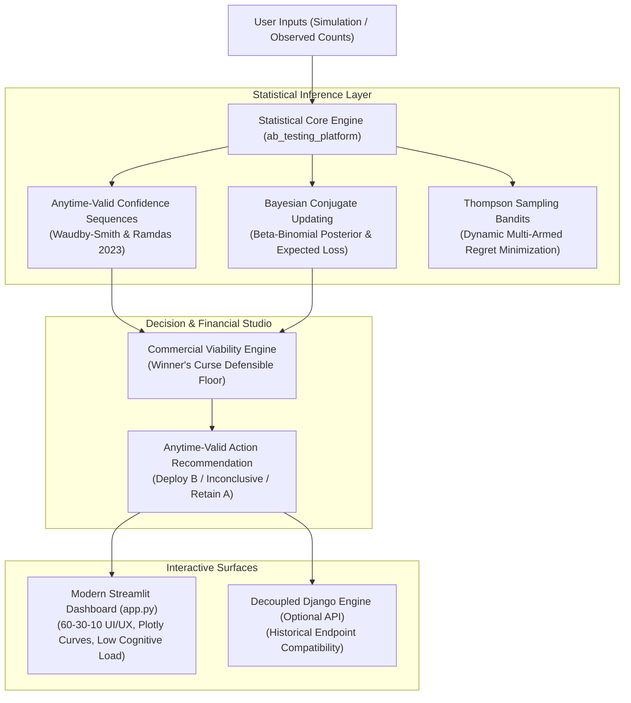

# OptiSim // Causal Inference & A/B Experimentation Studio

A mathematically rigorous, production-grade causal inference and experimentation platform. Designed to eliminate common statistical fallacies in commercial experimentation (the peeking problem, winner's curse, and post-hoc power) through **Anytime-Valid Confidence Sequences**, **Bayesian Decision Theory**, and **Thompson Sampling Bandits**.

[](https://github.com/saranlab/OptiSim/actions/workflows/ci.yml)
[](LICENSE)
[](https://www.python.org/downloads/)
[](https://streamlit.io)

---

## 1. System Architecture



---

## 2. The 4 Critical Statistical Anti-Patterns Avoided

OptiSim is explicitly architected to overcome four common industry pitfalls in causal inference and online experimentation:

### Anti-Pattern 1: The "Peeking Problem" & False Alpha Inflation
* **The Vulnerability**: Standard fixed-horizon Z-tests assume a single pre-committed evaluation at sample size $N$. In reality, stakeholders continuously refresh dashboards. Because the running sample mean is a random walk whose maximum grows with $\sqrt{2 \log \log n}$, peeking 20 times inflates a nominal 5% Type I error rate to over **25-30%**.
* **OptiSim Solution**: **Time-Uniform Confidence Sequences (Waudby-Smith & Ramdas, 2023)**.
  $$\hat{\delta}_n \pm \sigma \sqrt{\frac{2(n\rho^2 + 1)}{n^2 \rho^2} \log\left(\frac{\sqrt{n\rho^2 + 1}}{\alpha}\right)}$$
  This guarantee holds simultaneously across all sample sizes: $\mathbb{P}(\forall n \ge 1, \; \delta^* \in \text{CS}_n) \ge 1 - \alpha$. Peeking is mathematically safe.

### Anti-Pattern 2: The "Winner's Curse" in Financial Projections
* **The Vulnerability**: Rolling out a variant *because* it passed a significance threshold ($p < \alpha$) selects for positive random noise. Quoting the observed point-estimate lift ($\hat{\delta}$) systematically overestimates future business revenue.
* **OptiSim Solution**: **Conservative Defensible Net Return**. Commercial projections are anchored to the lower bound of the confidence sequence:
  $$\text{Defensible Net ARR} = (\text{Projected Traffic} \times \text{CI}_{\text{lower}} \times \text{Rev/Conversion}) - \text{Setup Cost}$$

### Anti-Pattern 3: The "Post-Hoc Power" Fallacy
* **The Vulnerability**: Calculating statistical power *after* the test from the observed effect size and sample size (the "power approach fallacy", Hoenig & Heisey, 2001). Post-hoc power is merely a 1-to-1 transformation of the p-value that produces circular reasoning.
* **OptiSim Solution**: Statistical power ($1 - \beta$) is strictly utilized as an **a priori planning parameter** to establish required horizon sample sizes, never computed retroactively on observed data.

### Anti-Pattern 4: Relying Solely on $P(B > A)$
* **The Vulnerability**: Bayesian $P(B > A) = 95\%$ indicates probability of superiority, but completely ignores magnitude. If the 5% downside risk is devastating, deploying $B$ can cripple business revenue.
* **OptiSim Solution**: **Bayesian Expected Loss** $\mathbb{E}[\max(0, \theta_A - \theta_B)]$. Quantifies downside risk directly in conversion rate units to enable principled Bayesian Decision Theory.

---

## 3. UI/UX Design System (60-30-10 Rule)

The user interface follows modern cognitive ergonomics to eliminate stakeholder overwhelm:

1. **60% Dominant Neutral**: Clean `#F8FAFC` slate background for calm visual focus.
2. **30% Structural Secondary**: Elevated white card containers (`#FFFFFF`) with **zero harsh borders** (`border: none; box-shadow: 0 4px 20px rgba(15, 23, 42, 0.04); border-radius: 14px;`).
3. **10% Intentional Accent & Semantic Status**:
   - 🟢 **Deploy Variant B (Safe/Win)**: `#10B981` (Emerald)
   - 🟡 **Inconclusive / Keep Collecting (Caution)**: `#F59E0B` (Amber)
   - 🔴 **Retain Control A (Danger/Worse)**: `#EF4444` (Rose / Crimson)
   - 🔵 **Interactive Levers / Brand**: `#2563EB` (Royal Blue)

---

## 4. Repository Structure

```text
OptiSim/
├── app.py                      # Modern Reactive Streamlit Enterprise Studio
├── requirements.txt            # Production dependencies (Streamlit, Plotly, NumPy, SciPy)
├── README.md                   # System architecture & technical documentation
├── .gitignore                  # Production git rules (ignores pyc, venv, sqlite)
├── .github/
│   └── workflows/
│       └── ci.yml              # Automated continuous integration test suite
├── ab_testing_platform/        # Pure, decoupled mathematical & statistical core
│   ├── sequential.py           # Anytime-valid confidence sequence engine (Waudby-Smith & Ramdas)
│   ├── cuped.py                # CUPED variance reduction engine (Deng et al. 2013)
│   ├── delta_method.py         # Cluster-robust ratio metric inference (Deng et al. 2018)
│   ├── bayesian.py             # Beta-Binomial conjugate posterior & Expected Loss
│   ├── frequentist.py          # A priori sample size planning & Wald inference
│   ├── bandits.py              # Thompson Sampling & LinUCB contextual bandit simulation
│   ├── simulation.py           # Monte Carlo sample path simulator
│   ├── models.py               # Typed dataclasses and results
│   └── math_utils.py           # Numerical stability and distribution helpers
├── dashboard/                  # Application service layer
│   └── services.py             # ExperimentDashboardService orchestrator
├── examples/
│   └── usage_example.py        # Standalone Python CLI usage example
└── tests/                      # Automated unittest suite (42 unit tests)
```

---

## 5. Installation & Quickstart

### 1. Environment Setup
```bash
# Clone repository
git clone https://github.com/saranlab/OptiSim.git
cd OptiSim

# Create and activate virtual environment
python -m venv venv
venv\Scripts\activate      # Windows
# source venv/bin/activate # macOS / Linux

# Install dependencies
pip install -r requirements.txt
```

### 2. Run Automated Test Suite
```bash
python -m unittest discover tests -v
```

### 3. Launch Reactive Streamlit Studio
```bash
streamlit run app.py
```
Open `http://localhost:8501` to access:
- **Diagnostic & Anytime Inference**: Real-time confidence sequence vs. Wald intervals and Bayesian posterior curves.
- **Financial Impact Studio**: Live ROI calculations with Winner's Curse conservative floor.
- **Simulation & Bandit Lab**: Interactive Monte Carlo convergence and Thompson Sampling cumulative regret curves.
- **Statistical Rigor Reference**: Mathematical derivations and anytime-valid guarantees.

---

## 6. License

Distributed under the MIT License. See `LICENSE` for more information.
